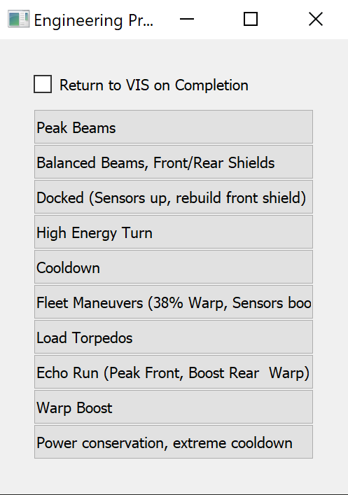

# TSN Engineering Hotkeys

This a UI that assists an engineer in the game Artemis Bridge Simulator by providing relevant hotkeys for the attack and maneuvering patterns.



Place it off to the side of your Artemis window, give it any rig list of any length, and become a more efficient engineer!

# Installation

1. [Clone this repository](https://docs.github.com/en/repositories/creating-and-managing-repositories/cloning-a-repository)
2. Install Python and PIP. If you don't know how to do this yet, try [this guide](https://realpython.com/installing-python/).
3. Install the requirements with `pip install -r requirements.txt`
4. Run the program with `python -m tsn` from the project root folder.

# Use

Copy a rig list as JSON from [this website](https://cattail.nu/artemis/engineersRigbook/index.php) and create a file at the root of this folder called `rig_list.json`.

This tool will always output a list of length 10, however with this tool you can manually make this list as long as you want!

Then run the program with `python -m tsn`.

Open Artemis as an engineer in Windowed mode at 2048x1536 resolution. If this resolution does not work for you, you will need to do the following things:

1. Make a screenshot of the `"ENGINR"` button in the top left corner of the Artemis window at your desired resolution.
2. Put it in a folder in `assets` with the dimensions of the window as the name. EG: `assets/1920x1080/enginr.png`
3. Do the same for the `"VIS"` button **from the engineering screen**, and save it under `assets/<FOLDER>/vis.png`. **It's very important that "VIS" is not currently selected when you take the picture.**
4. Now create a `settings.json` file in the root of the workspace that looks like the following:

```json
{
    "WINDOW_DIMENSIONS": [2048, 1536],
    "PRESS_INTERVAL_SEC": 0.1,
    "BUTTON_WIDTH": 400,
    "IMAGE_DETECTION_CONFIDENCE": 0.5
}
```

Replace the settings as you require.

5. Lastly, please [make a PR](https://docs.github.com/en/pull-requests/collaborating-with-pull-requests/proposing-changes-to-your-work-with-pull-requests/creating-a-pull-request) so others don't have to do the same!

# Development

Please install the pre-commit hooks with `pre-commit install` to ensure that your code is formatted correctly when you commit.

## VSCode Settings

Here are some VSCode settings to get you started with local development.

```json
// .vscode/launch.json
{
    // Use IntelliSense to learn about possible attributes.
    // Hover to view descriptions of existing attributes.
    // For more information, visit: https://go.microsoft.com/fwlink/?linkid=830387
    "version": "0.2.0",
    "configurations": [
        {
            "name": "Main",
            "type": "python",
            "request": "launch",
            "program": "tsn/__main__.py",
            "cwd": "${workspaceRoot}",
            "env": {"PYTHONPATH": "${workspaceRoot}"},
            "console": "integratedTerminal",
            "justMyCode": true
        }
    ]
}
```

```json
// .vscode/settings.json
{
    "python.testing.pytestArgs": [
        "tsn"
    ],
    "python.testing.cwd": "${workspaceRoot}",
    "python.testing.unittestEnabled": false,
    "python.testing.pytestEnabled": true
}
```
